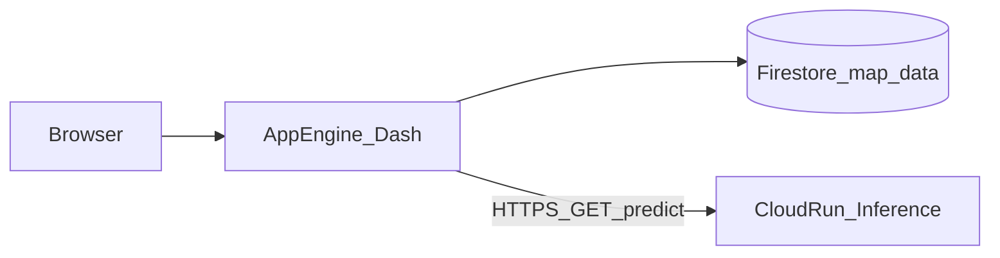

# Underserved transit routes — CS-163

A concise course project: combine VTA ridership, schedules, and demographics; score and cluster routes; publish a **Dash** site on **App Engine** backed by **Firestore**; expose **Random Forest** + **Prophet** inference on **Cloud Run**, called from the **Findings** page.

## Table of contents

- [About the project](#about-the-project)
- [Directory information](#directory-information)
- [Built with](#built-with)
- [Getting started](#getting-started)
- [Usage](#usage)
- [Pipeline flow](#pipeline-flow)
- [System design and scaling](#system-design-and-scaling)
- [Inference service](#inference-service)
- [Cloud-hosted data](#cloud-hosted-data)
- [Live application](#live-application)
- [Roadmap](#roadmap)

---

## About the project

We analyze Santa Clara County / VTA transit at the stop and route level: demand, service, and neighborhood need. Outputs include an **underserved score**, **K-Means clusters**, a **Random Forest** priority flag, and **Prophet**-style forecasts served through a small REST API. The public story lives in a multi-page Dash app; models and metrics are integrated with Google Cloud (Firestore + Cloud Run + App Engine).

**Training artifacts:** notebooks or scripts that trained the models are not all committed here; exported files under `Inference/` are what Cloud Run loads. Add a `training/` folder later if you want full reproducibility in GitHub.

---

## Directory information

### **`website/`**

```text
website/
├── app.yaml              # App Engine: python312, F1, gunicorn main:server
├── main.py               # Dash app: Firestore load, pages, Cloud Run client
├── requirements.txt      # dash, plotly, firestore, requests, gunicorn, …
└── assets/               # CSS and static images for methodology / findings
```

The **website** is the student-facing UI: Home, EDA, Methodology (includes interactive map), and Findings (tables + live `/predict` calls to Cloud Run).

### **`Inference/`**

```text
Inference/
├── Dockerfile            # python:3.9-slim; pip install flask, pandas, sklearn, prophet, …
├── api.py                # Flask app: /health, /predict
├── rf_model.joblib
├── prophet_models_dict.joblib
└── df_metrics_future.csv
```

The **Inference** folder is the Cloud Run **Docker** context: build from this directory so `api.py` and assets land at `/app` and Gunicorn can run `api:app`.

### **`data/`**

```text
data/
├── route_metrics_map_data.csv   # Used by firestore.py → Firestore upload
└── …                            # Other raw or intermediate CSVs / inputs
```

### **Repository root**

```text
./
├── README.md
├── firestore.py          # Batch upload CSV rows → Firestore collection route_metrics
├── requirements.txt      # Optional root listing; App Engine uses website/requirements.txt
└── …
```

---

## Built with


---

## Getting started

### Prerequisites

- Python **3.12** for the Dash app (matches [`website/app.yaml`](website/app.yaml)).
- Python **3.9** / **Docker** for the inference image ([`Inference/Dockerfile`](Inference/Dockerfile)).
- A Google Cloud project with **Firestore** (Native mode) and **billing** enabled; **App Engine** and **Cloud Run** APIs used for deploys.
- [`gcloud` CLI](https://cloud.google.com/sdk/docs/install) and Application Default Credentials (`gcloud auth application-default login`) or a service account JSON with Firestore access.

### Installation

1. Clone the repository  
   ```bash
   git clone https://github.com/RyderSab/CS-163-Project.git
   cd CS-163-Project
   ```

2. Website virtual environment  
   ```bash
   cd website
   python -m venv .venv
   # Windows: .venv\Scripts\activate
   pip install -r requirements.txt
   ```

3. Optional: set `INFERENCE_SERVICE_URL` if your Cloud Run URL differs from the default in `main.py`.

---

## Usage

### Run the Dash app locally

```bash
cd website
python main.py
```

Open the URL shown in the terminal (typically `http://127.0.0.1:8050`).

### Build and run inference (Docker)

From repo root:

```bash
cd Inference
docker build -t transit-inference .
docker run --rm -e PORT=8080 -p 8080:8080 transit-inference
```

Smoke test: `http://localhost:8080/health` and `http://localhost:8080/predict?route_id=23` (use a route id present in `df_metrics_future.csv`).

### Upload metrics to Firestore

Run from **repository root** so `data/route_metrics_map_data.csv` resolves. Adjust the project id in [`firestore.py`](firestore.py) if needed.

```bash
pip install pandas google-cloud-firestore
python firestore.py
```

### Deploy (typical)

```bash
# App Engine — from website/
cd website
gcloud app deploy

# Cloud Run — build context must be Inference/
cd ../Inference
gcloud builds submit --tag gcr.io/YOUR_PROJECT_ID/transit-inference .
gcloud run deploy YOUR_SERVICE_NAME --image gcr.io/YOUR_PROJECT_ID/transit-inference --region YOUR_REGION
```

Set **App Engine** environment variable `INFERENCE_SERVICE_URL` to the Cloud Run base URL if you do not rely on the default in code.

---

## Pipeline flow

1. **Acquire** VTA ridership, GTFS, Census / MTC equity data (see data-source links on the site Home page).
2. **Process** outside this repo (notebooks/scripts): joins, scores, clusters, train RF and Prophet; export CSV + `joblib` files.
3. **Publish** tabular map data: `firestore.py` → Firestore `map-data` / `route_metrics`.
4. **Serve** models: Docker image on **Cloud Run** (`Inference/`).
5. **Serve** UI: **App Engine** runs Dash; users trigger predictions from **Findings**.

---

## System design and scaling



| Piece | Role | Scaling notes |
|--------|------|----------------|
| **App Engine** | Hosts Gunicorn + Dash (`F1`, Python 3.12) | Autoscales with traffic; each instance loads Firestore into memory at startup. Raise `instance_class` or set min instances if cold starts hurt. |
| **Firestore** | `route_metrics` documents for the map and tables | Serverless reads; size your documents and indexes for the query pattern (here: full collection stream at startup). |
| **Cloud Run** | Flask + Gunicorn + models | Scales to zero; first request after idle pays cold-start cost (model load). Increase memory/CPU if needed. |

---

## Inference service

| Item | Location |
|------|-----------|
| Docker image | [`Inference/Dockerfile`](Inference/Dockerfile) |
| HTTP application | [`Inference/api.py`](Inference/api.py) |

| Endpoint | Description |
|----------|-------------|
| `GET /health` | Returns JSON `{"status": "healthy"}`. |
| `GET /predict?route_id=<id>` | Returns JSON with `route_id`, `is_underserved_prediction`, `underserved_score`, `next_month_forecast`, `metrics`, or an `error` message / HTTP 404 if the route is missing from `df_metrics_future.csv`. |

The Dash app calls this service from [`website/main.py`](website/main.py) (Findings page) using `requests` and optional env `INFERENCE_SERVICE_URL`.

---

## Cloud-hosted data

| Question | Answer |
|----------|--------|
| **What is stored?** | Route–stop level metrics used by the map and tables (e.g. lat/lon, cluster label, underserved score, demographic fields)—aligned with rows in `data/route_metrics_map_data.csv` when uploaded. |
| **How?** | Firestore database id **`map-data`**, collection **`route_metrics`**, one document per uploaded row ([`firestore.py`](firestore.py)). |
| **How does the site use it?** | [`website/main.py`](website/main.py) uses `firestore.Client(database='map-data')`, streams `route_metrics`, and builds a pandas `DataFrame` for Plotly and Dash components at startup. |

---

## Live application

Replace the placeholder with your deployed App Engine URL:

- **Website:** `https://YOUR-SERVICE-ID-dot-YOUR-PROJECT-ID.REGION_ID.r.appspot.com`
- **Repository:** `https://github.com/RyderSab/CS-163-Project`

---

## Roadmap

- [x] Dash multi-page site (Home, EDA, Methodology, Findings)
- [x] Firestore-backed map and tables
- [x] Cloud Run inference + Findings page integration
- [ ] Paste production **App Engine** URL into [Live application](#live-application) above
- [ ] Optional: commit training notebooks under `training/` for full reproducibility

---

## Contact

**Your name / email** — update this block for your course submission.

**Project link:** [https://github.com/RyderSab/CS-163-Project](https://github.com/RyderSab/CS-163-Project)

---

**Git hygiene:** several focused commits read better than a single large dump before deadlines.
